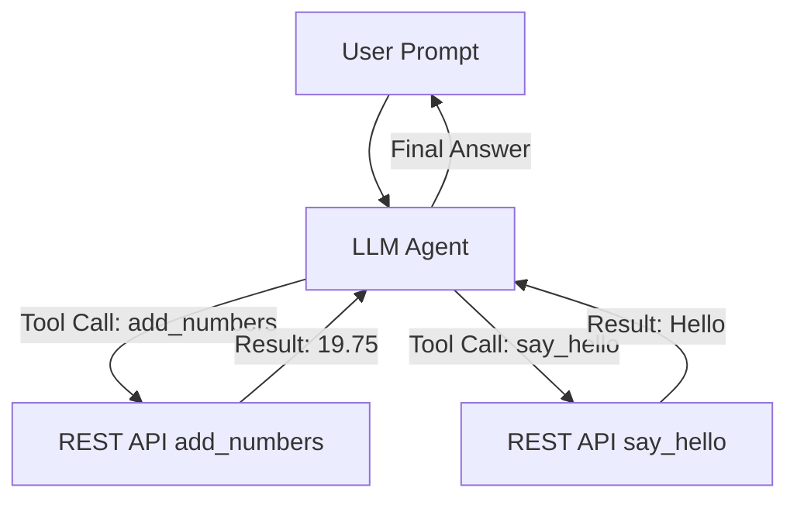

# 🧩 Basic MCP with Local LLM (Ollama)

This project demonstrates an end-to-end MCP + Local LLM agent setup with Ollama and REST API tools.

See sections: Setup, Run, Postman, Diagram, Troubleshooting.

Got it 👍 — your current `README.md`  covers the basics, but it’s missing the **story of the setup issues and their resolutions**, and clear notes about the **YAML configuration** (local paths, LLM model settings, etc.). Let me give you a **refined README.md** that:

1. **Documents the full journey** (errors + fixes) so others don’t waste 36 hours.
2. **Explains the YAML config** (where to change local paths, models).
3. **Adds a troubleshooting/FAQ section** with the real issues we solved:

   * venv vs system Python mismatch
   * Windows `WinError 10106` issue
   * `pydantic` version conflict with `fastmcp`
   * Missing args (`a/b`) → fixed via canonicalizer
   * Model finalizing too early → fixed with deterministic greeting enforcement.

---

Here’s the improved `README.md` file you can drop in:

```markdown
# 🧩 Basic MCP with Local LLM (Ollama)

An **end-to-end AI agent demo** showing how to connect:
- **MCP (Model Context Protocol)** servers/clients
- **Ollama** local LLMs
- **Custom REST API tools** (`add_numbers`, `say_hello`)
- An **agent loop** that orchestrates tool calls deterministically

---

## ✨ What This Project Demonstrates
- Run **LLM + tools locally** (no cloud dependency)
- Tools exposed via **REST API** are automatically callable by the MCP agent
- **YAML-based configuration** for model + paths
- **Error handling & canonicalization** (LLM outputs → valid tool calls)
- **Multi-step orchestration**:  
  Example → `Add 12.5 and 7.25, then say hello`  
  Output → `The sum is 19.75. Hello from REST API!`

---

## 📂 Project Structure

```

BasicMCP\_With\_Local\_LLM\_E2EProgram/
├── app/
│   ├── agent/
│   │   ├── llm\_agent.py        # Main agent loop
│   │   ├── prompts.py          # System prompts
│   │   ├── tool\_catalog.py     # Renders tool descriptions
│   ├── api/
│   │   └── rest\_api.py         # REST API exposing add\_numbers, say\_hello
│   ├── mcp/
│   │   ├── mcp\_server.py       # STDIO MCP server
│   │   ├── mcp\_server\_http.py  # HTTP MCP server
│   │   └── mcp\_client\_utils.py # Client utilities
│   ├── config/
│   │   ├── settings.yaml       # LLM + MCP config
│   │   └── logging.yaml        # Logging setup
├── requirements.txt
└── README.md

````

---

## ⚙️ Setup

### 1. Clone & Create Virtual Env
```powershell
git clone <your-repo-url>
cd BasicMCP_With_Local_LLM_E2EProgram
python -m venv .venv
.venv\Scripts\Activate.ps1   # Windows
# source .venv/bin/activate  # Linux/Mac
````

### 2. Install Requirements

```powershell
pip install --upgrade pip
pip install -r requirements.txt
```

### 3. Install Ollama

* [Download Ollama](https://ollama.ai)
* Pull models:

```powershell
ollama pull llama3.2:3b-instruct-q4_K_M
ollama pull tinyllama
```

### 4. Configure YAML

Edit `app/config/settings.yaml`:

```yaml
llm:
  model: "llama3.2:3b-instruct-q4_K_M"
  timeout_s: 30

mcp:
  server_path: "C:/Aravind/Knowledge/AI/MCP/BasicMCP_With_Local_LLM_E2EProgram/app/mcp/mcp_server.py"
  # adjust local paths if different
```

---

## ▶️ Run

### Step 1. Start REST API

```powershell
python app/api/rest_api.py
# http://127.0.0.1:8000
```

### Step 2. Run MCP STDIO server

```powershell
python app/mcp/mcp_server.py
```

### Step 3. Run Agent

```powershell
python -m app.agent.llm_agent "Add 12.5 and 7.25, then say hello."
```

✅ Expected:

```
The sum is 19.75. Hello from REST API!
```

---

## 📬 Postman Collection

Included: `docs/BasicMCP_Agent.postman_collection.json`

* `GET http://127.0.0.1:8000/hello`
* `POST http://127.0.0.1:8000/add_numbers`

```json
{
  "a": 12.5,
  "b": 7.25
}
```

---

## 🖼 Diagram



---

## 🛠 Problems We Encountered & Fixes

### 1. venv vs System Python

**Error:** MCP ran with `C:\Python312\...` instead of `.venv`.
**Fix:** Always activate `.venv` and run `python -m app.agent.llm_agent ...`.

---

### 2. Windows `WinError 10106`

**Error:**

```
OSError: [WinError 10106] The requested service provider could not be loaded
```

**Cause:** Python’s `asyncio` using wrong loop with Windows.
**Fix:** Restart machine, ensure running inside venv, and avoid mixing system Python.

---

### 3. Pydantic Version Conflict

**Error:** `ImportError: cannot import name '_BaseUrl' from 'pydantic.networks'`
**Cause:** `fastmcp` required Pydantic <2, but `mcp` required >=2.7.
**Fix:** Align deps in `requirements.txt`:

```txt
pydantic>=2.7
mcp==1.1.1
fastapi<0.100
```

---

### 4. Missing Tool Args

**Error:**

```
Field required [type=missing, input_value={'a': 19.75}, ...]
```

**Cause:** LLM produced `{"a": 19.75}` instead of `{"a": 12.5, "b": 7.25}`.
**Fix:** Added **canonicalizer** → maps `number1/number2` → `a/b` and backfills from user input.

---

### 5. Model Finalizing Too Early

**Error:** Returned only `19.75`.
**Fix:** Added deterministic orchestration:

* After `add_numbers`, if user asked to greet → force `say_hello` before final.

---

## ✅ Lessons

* **YAML config** makes paths & models editable without touching code.
* **Guardrails** (JSON-only, canonicalization) prevent fragile LLM outputs.
* **Deterministic orchestration** is key when chaining multiple tools.
* Documenting problems helps others avoid the same 36-hour debugging session!

---

## 🎯 Example

```powershell
python -m app.agent.llm_agent "Add 100 and 50, then say hello."
```

Output:

```
The sum is 150. Hello from REST API!
```

```


